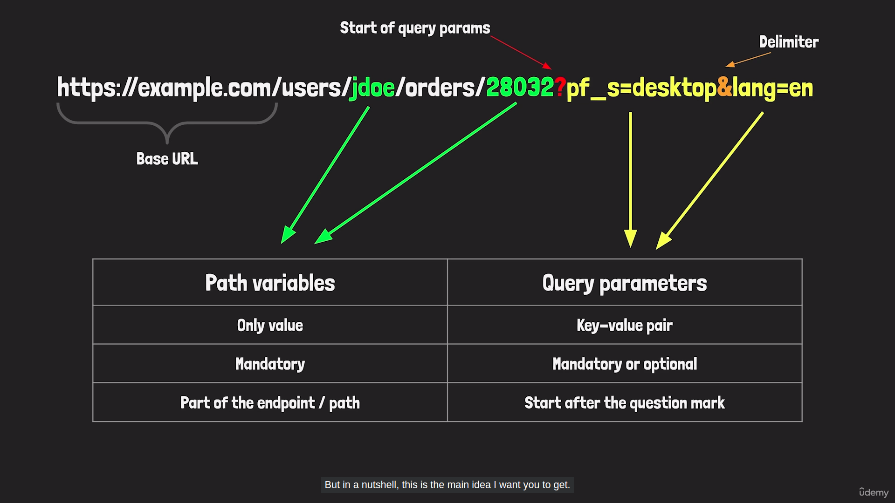

#  Section 2: Creating REST API requests with Postman

-  [Postman landscape PDF](https://github.com/bappasahabapi/postman-api-testing/blob/main/Postman_Landscape.pdf)

[Grocery Shop Postman Collection Export File ](https://github.com/bappasahabapi/postman-api-testing/blob/main/Grocery-Shop.postman_collection.json)

####  01. Path variable & Query variable

#### 02. [HTTP Status Code](https://developer.mozilla.org/en-US/docs/Web/HTTP/Status#successful_responses)
